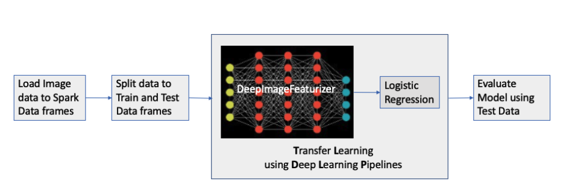
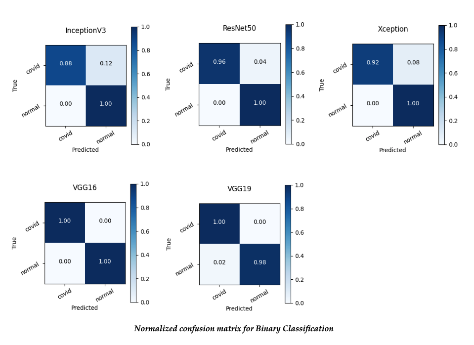
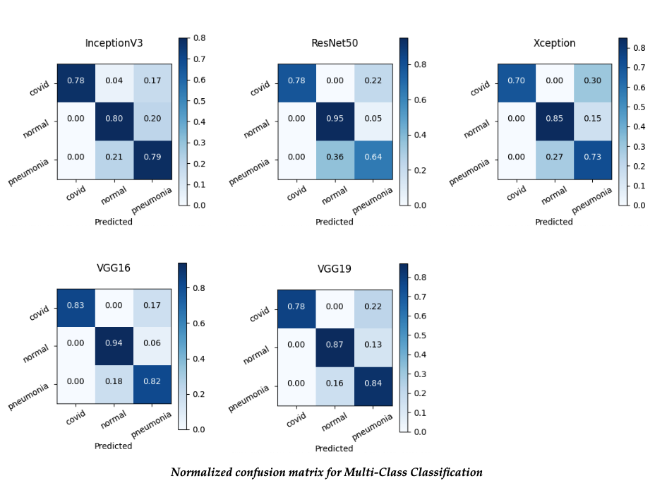

# COVID19 X-Ray Classification

This project is completed as part of [CSE-6250](http://sunlab.org/teaching/cse6250/fall2020/) curriculum.

## Project Members
* Amit Tripathy, Arnab Som, Syamala Bandi, Love Kumar

## Description
X-ray image classification is a very important task for clinical tasks.
In the recent years, there have been X-ray image datasets released for training machine learning models.
It has been shown that COVID-19 can be detected from X-ray images.
Chest X-rays are the first choice in terms of the initial imaging test when caring for patients with suspected COVID19.
Chest X-rays are the preferred initial imaging modality when pneumonia is suspected and the radiation dose of CXR (0.02 mSv for a PA film) is lower than the radiation dose
of chest CT scans (7 mSv), putting the patients less at risk of radiation-related diseases such as cancer.
Thus COVID-19 diagnostic plays an important role in clinical workflows for helping clinicians perform more important tasks.
In this task, the goal is to develop models for automatic COVID-19 detection using chest X-ray images.
The trained model developed should be able to provide accurate diagnostics for binary classification (COVID vs. No-Findings)
and multi-class classification (COVID vs. No-Findings vs. Pneumonia) settings.

## Implementation Details
We are using this [Deep Learning Pipelines](https://github.com/databricks/spark-deep-learning/tree/v1.5.0) to build a multi-class image classifier.
DLP is a high-level Deep Learning framework that facilitates common Deep Learning workflows via the Spark MLlib Pipelines API.
We are loading image data, splitting it into Train and Test dataset, extracting features from Training dataset using DeepImageFeaturizer, followed by
Logistic Regression model for classification. Then we are evaluating the model against Test dataset. DeepImageFeaturizer supports InceptionV3, ResNet50, VGG16, VGG19 and Xception
models for transfer learning.

On a high-level, following is the model training flow diagram.


Details for setting up environment and training the model can be found [here](code/)

### Dataset:  
We are using the publicly available dataset from the [COVID-19 dataset](https://github.com/muhammedtalo/COVID-19) for training & testing the models (both Binary-Classification and Multi-Class Classification).
This dataset is a combination of the data from multiple sources and contains 125 COVID-19 images collected from COVID-Chest-Xray-dataset.
Normal and Pneumonia images are collected from [COVID-Chest-xray-dataset](https://github.com/ieee8023/covid-chestxray-dataset).

In summary, this dataset has 125 Covid19, 500 No-Findings and 500 Pneumonia X-ray-Images.
The average size for the input file is 300KB- 400KB and there are some files having size greater than 1 MB.
We re-sized the input images further as part of the data preparation step.
Image resizing helped in reducing the file size to ~ 30KB. Resize Image Data is loaded into spark dataframes for further analysis in the pipeline.
The [actual images](code/dataset/) and [resize images](code/dataset_resized/) are present in this git repository.

<br>


## Experimental Setup

Our code is structured in a pySpark based project for model training using DeepImageFeaturizer libraries from Databricks.
We are using the anaconda and [environment.yml](./code/environment.yml) has all the dependencies listed for creating python(=3.7) conda environments needed for the model training.
The pipeline is tested locally on Macbook (2.4 GHz, 8-Core Intel Core i9, 16 GB RAM) using spark in local mode.
We also tested the job against a local standalone spark cluster.
The application uses [X-ray Image data](./code/dataset_resized/) stored on a local filesystem to train and test a deep learning model for both binary and multi-class classification of COVID conditions.

[wrapper.sh](./code/wrapper.sh) helps in setting up the environment as well as running the model training jobs

### 1. Setup Conda environment
First step is to setup conda environment.

You can setup conda environment either using
```
conda env create -f environment.yml
```
or using
```
sh wrapper.sh env-setup
```

### 2. Activate Conda environment
Next step is to activate the conda environment.
In [environment.yml](./code/environment.yml), we are using **team11-pyspark** as conda environment name, so
```
conda activate team11-pyspark
```

### 3. Run Job

We are using [Deep Learning Pipeline - v1.5.0](https://github.com/databricks/spark-deep-learning/tree/v1.5.0) for model training.

Our model training pipeline looks like this
```
# Pipeline [DeepImageFeaturizer, LogisticRegression]
pipeline = Pipeline(stages=[dif, lr])
```

DeepImageFeaturizer supports the following models from Keras:
* InceptionV3
* Xception
* ResNet50
* VGG16
* VGG19

For model training, instead of passing too many parameters on command line, we are reading them from [config.yaml](./code/config.yaml)

#### Model Training : Binary Classification
```
# Using Model: InceptionV3
sh wrapper.sh run InceptionV3_binary_classification

# Using Model: ResNet50
sh wrapper.sh run ResNet50_binary_classification

# Using Model: VGG16
sh wrapper.sh run VGG16_binary_classification

# Using Model: VGG19
sh wrapper.sh run VGG19_binary_classification

# Using Model: Xception
sh wrapper.sh run Xception_binary_classification
```

#### Model Training : Multi-class Classification
```
# Using Model: InceptionV3
sh wrapper.sh run InceptionV3_multiclass_classification

# Using Model: ResNet50
sh wrapper.sh run ResNet50_multiclass_classification

# Using Model: VGG16
sh wrapper.sh run VGG16_multiclass_classification

# Using Model: VGG19
sh wrapper.sh run VGG19_multiclass_classification

# Using Model: Xception
sh wrapper.sh run Xception_multiclass_classification
```

#### Resize Images
```
# You may need to change the output location in config.yaml
sh wrapper.sh run dataset_resize
```


### Models:   

**Binary Classification**:

 We are using Covid-19 and normal (no-finding) images for binary classification. Using a pre-trained VGG16 model, we are able to achieve 100% accuracy.
 VGG19 models also predicted all the covid x-rays accurately with overall accuracy of  98.5 %. Even though ResNet50 has 99.3% accuracy, it could predict 96% covid x-rays accurately.  


<br>

**Multi-Class Classification**:

We are using Covid-19, normal(no-finding) and Pneumonia images for multi-class classification. Among all the models,
VGG16 has highest total accuracy (87.2%) and 83% accuracy(highest among the models) in predicting covid-19 x-ray and 82% accuracy for pneumonia x-rays.   

<br>
<br>
